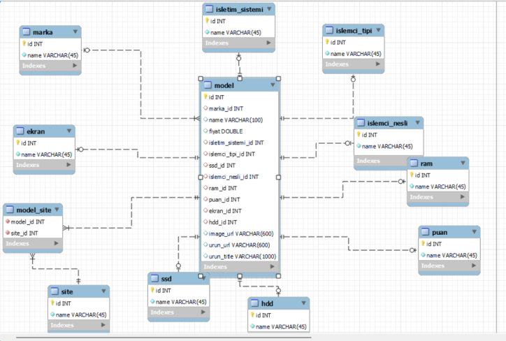
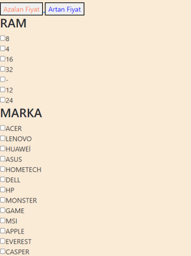
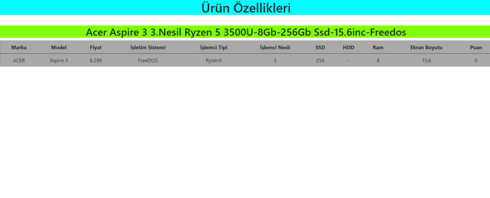
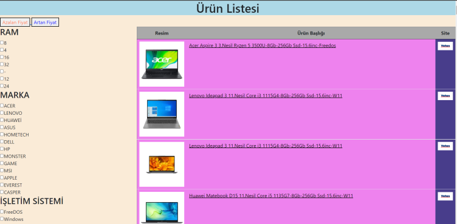
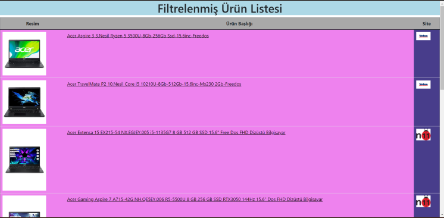

 # E-Commerce Site with Web Scraping (Web Scraping ile E-Ticaret Sitesi)
 
 ## Proje Raporu ve daha fazla bilgi için Proje Raporu.pdf
 
 
***Web*** ***scraping*** ***ile*** ***belirlenmiş*** ***en*** ***az***
***4*** ***siteden*** ***dizüstü*** ***bilgisayar***
***kategorisindeki*** ***ürünlerin*** ***özellikleri,*** ***başlık,***
***resim*** ***ve*** ***daha*** ***bir*** ***çok*** ***özelliğinin***
***çekilip*** ***bir*** ***web*** ***sitesinde*** ***gösterilmesi***

***Anahtar*** ***Kelimeler:*** ***web***
***scraping,*** ***e-ticaret*** ***,*** ***kategorileştirme,***
***filtreleme***

**Projenin** **Özeti**

Yazılım laboratuvarı 1 projesi olarak bizden "Web Scraping E-Ticaret "
adındaki bir uygulama yapılması istendi. Biz projenin isterlerinden
biriolan admin panelikısmını yapamadık ve tabi ki buna neden olan en
büyük faktörlerinden birisi de zamandı. O yüzden raporumuzda admin
panelden bahsetmeyeceğiz.

Biz bu proje için bizden istenenler doğrultusunda programlama
dillerinden JAVA, PHP, HTML, CSS dillerini database olarakta MYSQL
kullanmayı uygun gördük.

Projemizin isterleriüzerinewebscrapingilealdığımız verileri bir database
ekleyip daha sonrasında bir sitede göstermekti. Bizde n11, trendyol,
teknosa, vatan sitelerinden aldığımız verileri pcdb1 veri tabanına
ekledik. Bu verileri kullanarakta localde yer alan bir web sitesi
tasarladık.

> **I.** **GİRİŞ**

Projenin konusu Web scraping ile belirlenmiş en az 4 siteden dizüstü
bilgisayar kategorisindeki ürünlerin özellikleri, başlık, resim ve daha
bir çok özelliğinin çekilip bir web sitesinde gösterilmesi Biz bu proje
için bizden istenenler doğrultusunda programlama dillerinden JAVA, PHP,
HTML, CSS dillerini database olarakta MYSQL kullanmayı uygun gördük.

> **II.** **YÖNTEM**

Bu projede kullanılan yöntem 4 aşamada anlatılacaktır.

1.Aşama: Öncelikle 4 site belirlendi. Bu siteler N11, Trendyol, Vatan,
Teknosa. Bu sitelerin yapısı incelenip web scraping için gerekli
kütüphaneler araştırıldı. Java da iki alternatifimiz bulunmaktaydı.
HtmlUnit ve JavaSoup. Kullanışlılık ve hız konusunda daha iyi olduğunu
düşündüğümüz JavaSoup jar'ını kullandık. Kütüphanenin içinde barınan
fonksiyonlarla urun_title, urun_image, fiyat ve diğer özellikler için de arraylist ile
bu bilgileri kayıt ettik.

Ürünün bütün özelliklerini Jsoup ile aldıktan sonra bunları bir
veritabanına aktarmak gerekiyordu. Dünyada açık kaynaklı ve aynı zamanda
çok kullanılan Mysql veritabanına aktarmalıydık.

2.Aşama: 1.aşamada aldığımız verileri bir veritabanına kayıt etmek için
bir veri tabanı oluşturduk. Adı pcdb1 olan bu veritabanına verilerimizi
kaydettik. Fakat öncelikle pcdb1 veritabanını oluşturmadan önce bir EER
diyagramını oluşturduk. Çünkü bu projede isterler arasında olan
normalizasyon işlemlerini daha kolay yapabiliyor ve görüntü olarakta
genel şablonu görmek için kullandık. Oluşturduğumuz EER diyagram ; 1nf,
2nf, 3nf yani çokaçok(many to many) ilişkisine de uymaktadır.
Oluşturulan veritabanına INSERT ettikten ve oluşan hataları düzelttikten
sonra 3.aşamaya geçildi.

3.Aşama: Bu aşamada 2.aşamadaki verileri insert edip düzenledikten sonra
bu verilerin gösterileceği site yapımına başlandı. Öncelikle HTML bilgilerimizi tazeledikten sonra ana şablon
hazılandı. CSS ile bu oluşturduğumuz temel yapıyı görüntü olarak
düzenlemiş olduk. Ve geriye sadece PHP ile mantıksal aynı zamanda
veritabanı bağlantısını yaptık. Ve ürünleri bir tabloda göstermek için
gerekli kodlar ve algoritmalar kuruldu. Son aşamaya geçildi

4.Aşama: Bu aşamada elimizde bir web sitesi ve bu web sitesinde bine
yakın ürün bilgisi bulunmakta.

İsterler arasında filtreleme yapmamız gerektiği de vardı bu yüzden
filtreleme yapmamız gerekti. Öncelikle veri tabanından bu özelliklerin
dinamik olarak eklenmesi ve filtreleme sonucunu tabloda görmemiz
gerekli. Dinamik olucak şekilde yapılan filtreleme yeni bir sekmede
görüntülendi. Aynı zamanda Artan fiyat ve Azalan fiyat adında iki buton
eklendi. Bu butonlarda görevini yerine getirmektedir.

Oluşturulan Dosyalar :
> • anasayfa.php
>  
> • filtrelenmiş.php
>
> • urun_ozellikleri.php 
> 
> • Teknosa.java
>
> • N11.java
>
> • Trendyol.java
> 
> • Vatan.java

Kullanılan IDE'ler: Visual Studio Code ,Eclipse

> **SÖZDE** **KOD** 

1-BAŞLA

2-Bağlan(n11,teknosa,vatan,trendyol ) 

3-Marka verisini al

4-Ssd verisini al

5-Model verisini al

6-İslemci tipi verisini al

7- İslemci nesli verisini al 

8-İşletim sistemi verisini al

9-Ram verisini al

10- Puan verisini al 

11-Site verisini al 

12-Fiyat verisini al

13-Ürün resmi urlsini al 

14-Ürünün urlsini al

15-Ürün başlığını al

16-Alınan verileri veritabanına yaz

17-Site oluştur(Html)

18-Site Tasarla(Css)

19-Tablo oluştur

20-Veritabanına bağlan

21-Veritabanından ürünlerin verilerini al

22-Ürünleri listele(göster)

23-Ürünlerin özelliklerini veritabanından çek

24-Dinamik filtreleme sidebar oluştur

25-Filtelenmiş ürünleri listele

26-Ürünlerin özelliklerini veritabanından çek

> **III.** **DENEYSELSONUÇLAR**

> **V.** **SONUÇ**

Bu proje sayesinde web scraping ve site oluşturma konusunda kendime
değer kattım özellikle PHP konusunda kendimi iyileştirdiğimi
düşünüyorum. Aynı zamanda bir kütüphane nasıl indirilir, kurulur ve
fonksiyonları nasıl araştırılır öğrendim. Son olarakta bir web sitesinin
yapımının hangi aşamalardan geçtiğini ve ne kadar emek harcandığını
gördüm. Teşekkür ederim.

> **KAYNAKLAR**

1-Intro to Java Programming, Comprehensive Version (10th Edition) Y.
Daniel Liang

2- https://www.w3schools.com/php/default.asp

3- Veritabanı Mantığı Kerem Köseoğlu

4- Udemy -Komple Uygulamalı Web Geliştirme Eğitimi "Sadık Turan

5-Google images -- Vatan.png,Teknosa.png,N11.png,Trendyol.png
